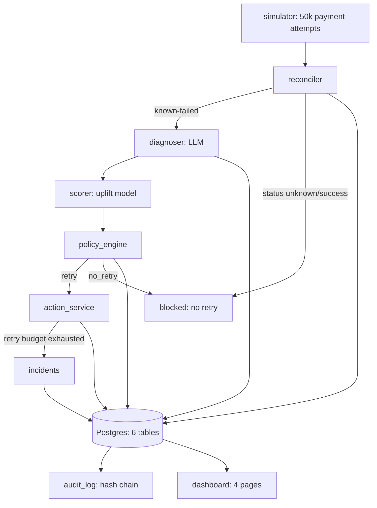

# Architecture

## The one-sentence thesis

Don't optimize for retry success probability — optimize for the incremental
revenue a retry creates. Everything below exists to make that computable,
auditable, and honest.

## System flow

Every arrow into Postgres also writes an `audit_log` entry. The dashboard
reads only from Postgres and from two backend-produced artifacts (trained
model files, sensitivity sweep results) — it never recomputes anything
expensive on request.

## Component responsibilities

| Component | File(s) | Job | Talks to external systems? |
|---|---|---|---|
| Simulator | `backend/simulator/` | Generates the payment-attempt population and each failed attempt's hidden ground-truth recovery curve. The ground truth lives *outside* the app DB entirely — no application code path can read it. | No |
| Reconciler | `app/services/reconciler.py` | Always runs first. Resolves whether a payment's status is known-failed before anything downstream can act. Mocked gateway (no real Razorpay in this build). | Mocked |
| Diagnoser | `app/services/diagnoser.py` | LLM (Groq) converts a decline code into a structured, Pydantic-validated `FailureDiagnosis`. Classification only — never a retry/no-retry decision or a monetary figure. | Yes (Groq API) |
| Scorer / Scheduler | `app/services/scorer.py`, `scheduler.py` | Loads the trained T-learner, returns `uplift(now)` and `uplift(best_time)` for an attempt; turns that into a candidate retry timestamp. | No |
| Policy engine | `app/services/policy_engine.py`, `app/config/policy.yaml` | Deterministic gate. Reconciliation must be resolved; hard declines/fraud are blocked by a **deterministic taxonomy lookup**, never the LLM's own classification; diagnosis confidence and predicted uplift must both clear a bar. | No |
| Action service | `app/services/action_service.py`, `action_razorpay.py` | The only thing that talks to an external payment API. Idempotency key (`app/services/idempotency.py`) = `sha256(payment_id + action_type + scheduled_time + policy_version)`, checked against existing `actions` rows before ever calling out again. Max 2 retries on 5xx, exponential backoff, then a bounded `retry_exhausted` incident (written to the `incidents` table). Three interchangeable backends behind one `GatewayClient` protocol, selected via `ACTION_MODE`: `mock` (default, deterministic), `razorpay_test` (real HTTP to Razorpay's sandbox, test-key enforced), `off` (shadow — logs intent, calls nothing). | Mocked by default; real (sandbox) when `ACTION_MODE=razorpay_test` |
| Audit | `app/services/audit.py`, `app/api/audit.py` | Hash-chained, tamper-*evident* log. `verify_chain()` is a pure function (no DB dependency) so tamper detection is unit-tested directly. | No |
| Pipeline orchestrator | `app/services/pipeline.py` | Chains all of the above into one `run_pipeline()` call, persisting a row in every relevant table plus an audit event at every stage. Used by both the CLI demo script and the dashboard's live batch endpoint — one implementation. | Transitively (Groq, action service per `ACTION_MODE`) |
| Dashboard | `frontend/src/` | Single page, four tabs, client-side tab switching (no router). Reads exclusively from the FastAPI backend. | No |

## Data model

Six tables (`backend/app/models/`), matching the five stages of the
pipeline: `payment_attempts` → `reconciliations` → `diagnoses` → `decisions`
→ `actions`, plus the cross-cutting `audit_log` and the `incidents` table
(written when the action service's retry budget is exhausted — a deliberate
sixth table beyond CLAUDE.md's original five, see `docs/DECISIONS.md`). All
primary keys are
auto-incrementing `BIGINT` (not UUID) — deliberate, because `audit_log`'s
hash chain gets free insertion ordering from it (`ORDER BY id`), and this is
a single-writer batch/simulator system where UUID's collision-avoidance
properties buy nothing. See `docs/DECISIONS.md` (Phase 1) for the full
reasoning, including why taxonomy-driven columns are `VARCHAR` validated at
the app layer rather than Postgres `ENUM`.

## The causal ML approach (why a T-learner, not a classifier)

A model that predicts "will this payment succeed if retried" answers the
wrong question — it would happily retry payments that were going to succeed
anyway, wasting money without creating any incremental revenue. The uplift
model is a **T-learner**: one XGBoost classifier trained on the historical
`no_retry` arm (`P(recover | X)`), one trained on the pooled retry arms with
offset-hours as a feature (`P(recover | X, offset)`). `uplift(X, offset) =
treated(X, offset) − control(X)`. The historical training data comes from a
genuine 5-arm randomized assignment (`no_retry`, `retry_0h/6h/24h/72h`) —
extended from an initial binary design specifically because a binary
retry/no-retry experiment can't teach a model anything about *timing*. See
`docs/ASSUMPTIONS.md` ("Uplift model" and "Simulator" (e)) for the full
mechanism.

**No leakage, by construction, not by convention.** The simulator's hidden
recovery-probability curve lives in a file (`simulator/output/ground_truth.jsonl`)
that no application or feature-building code ever reads. `ml/features.py`'s
`build_features()` additionally asserts at runtime that its input never
carries a ground-truth key, so a caller that accidentally merges the two
record types fails loudly instead of silently training on leaked
probabilities.

**Honest evaluation, including where the model loses.** `ml/evaluate.py`
scores every policy — the four hand-built baselines and the uplift-ranked
model — using the *hidden* ground-truth curve only to grade the outcome of
whichever action a policy already chose; the model's own predictions never
influence its own score. On the held-out chronological test set, the
learned model **ties, not beats**, the best hand-picked baseline (see
`README.md` for the numbers) — reported as-is, per the project's
non-negotiable: never tune the simulator to make the model win. The Phase 4
sensitivity sweep suggests the gap is primarily a training-data-volume
limitation, not a structural flaw in the approach — see `docs/DECISIONS.md`.

## Deployment topology

Three Docker Compose services: `postgres` (16-alpine), `backend` (FastAPI +
Uvicorn `--reload`, source bind-mounted), `frontend` (Vite dev server,
source bind-mounted). No message queue, no cache layer, no microservices —
CLAUDE.md is explicit that this project doesn't need Redis, Kafka, Celery,
or a service mesh, and adding any of them would be solving a scale problem
this project doesn't have.

## What's mocked vs. real

| Piece | Real | Mocked |
|---|---|---|
| Payment data | Simulated (grounded decline taxonomy, cited sources — see `docs/ASSUMPTIONS.md`) | — |
| LLM diagnosis | Real Groq API calls, real structured output | — |
| Uplift model | Real XGBoost training on real (simulated) data | — |
| Gateway status lookup (reconciler) | — | Mocked, but not arbitrarily — resolves from the simulator's own hidden ground truth for timeout-ambiguous codes, so it answers the way a real gateway honestly would |
| Payment retry API (action_service) | Real, when `ACTION_MODE=razorpay_test` — genuine sandbox HTTP calls, verified live | Default (`ACTION_MODE=mock`); a deliberately-503 client exists specifically to demo the retry-exhausted incident path |
| Audit chain | Real hash-chained Postgres writes, real tamper detection | — |

## Where to go next in the docs

- `docs/ASSUMPTIONS.md` — every frozen, cited-where-possible assumption behind the simulator, the model, the policy, and the audit chain.
- `docs/DECISIONS.md` — the non-obvious technical choices, in the order they were made, including every bug caught by live testing rather than code review.
- `docs/DEMO_SCRIPT.md` — the phase-by-phase walkthrough this project's demo video is built from.
