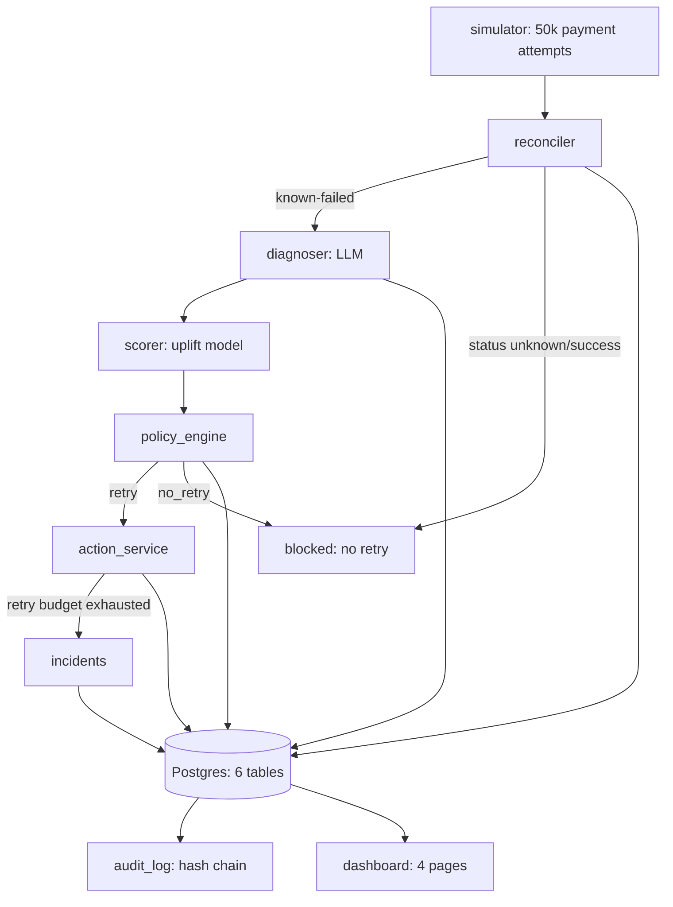

# Uplift

**Uplift-Aware Payment Recovery** — built for the Razorpay AI Buildathon (Track 03: AI Revenue Recovery).

Uplift takes a failed payment, reconciles its true status with the gateway before touching it, diagnoses the failure cause with an LLM, scores the incremental revenue of retrying it at several candidate times with a causal uplift model, and lets a deterministic policy engine — not the model, not the LLM — decide whether, when, and how to retry. Every external call runs through one bounded, idempotent action service, and every decision is written to a hash-chained, tamper-evident audit log.

## 📌 Problem & Domain

Payment failures aren't one problem, they're at least three: transient failures (an issuer's system was briefly down), structural failures (an expired card, a fraud flag), and timing-dependent failures (a customer's account has funds again on payday, not today). Merchants that retry every failure the same way get it wrong twice over — they retry transient failures before the cause has cleared, and they retry structural failures at all, burning processing cost on payments that were never going to succeed.

**Track:** Razorpay AI Buildathon — Track 03, AI Revenue Recovery.

## 🎯 Objective

**Target users:** payment platforms, PSPs, and merchants running high volumes of card/UPI/netbanking/wallet transactions who need a retry policy smarter than "retry everything" or "retry nothing."

**The pain point:** naive retry policies either leave real recoverable revenue on the table (never retry) or spend heavily to get there (retry everything, repeatedly) — on this project's 50,000-attempt simulated population, retrying every failure three times recovers revenue at nearly 2.75× the retry cost of a policy that targets and times its retries by cause.

**The value provided:** Uplift reframes the objective from "will this payment succeed if retried" to "does retrying this payment now create revenue that wouldn't otherwise exist" — the only question that matters commercially — and builds the full pipeline (reconciliation, LLM diagnosis, causal uplift scoring, deterministic policy gating, bounded action execution, tamper-evident audit) needed to act on that question safely.

## 🧠 Approach

**Why this problem:** payment retry is a rare case where the "obviously correct" ML framing (predict success probability) is actually the wrong objective — optimizing for incremental revenue instead of raw retry success is a genuinely different, more defensible target, and one that's easy to get subtly wrong without a rigorous evaluation harness to catch it.

**Key challenges addressed:**
- Building a simulator honest enough to evaluate against, with a decline taxonomy grounded in real PSP/network documentation (Razorpay's own card error codes, ISO 8583, NPCI UPI codes) rather than invented distributions.
- Keeping the LLM's classification role structurally separate from the policy engine's money-moving decisions, so a wrong diagnosis can never silently become a wrong retry.
- Evaluating the uplift model honestly against a hand-built baseline — including reporting the result as-is when the model ties rather than beats it, and using a sensitivity sweep to explain *why* instead of tuning the simulator until it wins.

**Breakthroughs:**
- A genuine 5-arm randomized treatment assignment in the simulator's historical data (not just retry/no-retry) — the only way to train a model that reasons about retry *timing*, not just retry yes/no, without leaking the simulator's hidden ground truth into training.
- A policy engine that never trusts the LLM's own classification for its safety-critical block check — caught live, on a real Groq call, when the model classified an unretriable decline as retriable and the deterministic gate blocked it anyway.

## 🛠️ Tech Stack

| Layer | Technology |
|---|---|
| Backend | FastAPI, Python 3.11 |
| Database | PostgreSQL 16, SQLAlchemy 2.0, Alembic |
| ML | XGBoost (T-learner: two independent uplift models) |
| LLM Inference | Groq (`openai/gpt-oss-120b`), structured-output classification only |
| Frontend | React 18, Vite, TypeScript, Tailwind, Recharts |
| HTTP client | httpx (confined to one file by an architecture test) |
| Containers | Docker, Docker Compose |
| Testing | pytest, ruff |

## ✨ Key Features

✅ **Reconciler-first pipeline** — no retry decision is ever made against an unreconciled or unknown payment status, closing the double-charge gap naive retry systems miss.

✅ **LLM diagnosis, structurally boxed in** — Groq classifies failure cause into a Pydantic-validated `FailureDiagnosis`; it cannot make or influence a money decision, and the policy engine's safety gate never reads its classification.

✅ **Causal uplift scoring (T-learner)** — two independent XGBoost models estimate `uplift(now)` and `uplift(offset)` per attempt, so the system asks "does this retry create revenue" rather than "will this retry succeed."

✅ **Deterministic policy engine** — a rules file (`policy.yaml`), not a model, gates every retry: reconciliation required, hard-decline block list, confidence floor, positive-uplift requirement.

✅ **Idempotent, budget-capped action service** — every external call carries a derived idempotency key and a hard 2-retry cap with exponential backoff; budget exhaustion raises a visible incident, never an infinite loop.

✅ **Hash-chained audit log** — every stage of every decision is recorded and tamper-*evident*; `/audit/verify` walks the chain and reports exactly where it breaks, live, over HTTP.

✅ **Honest evaluation harness** — four baselines, a held-out chronological test split, Qini/uplift@k, and a sensitivity sweep that reports where the learned policy wins and where it loses, without retuning the simulator to hide a loss.

## 📊 Evaluation Results

Baseline comparison, full 50,000-attempt population (6,693 failed), no ML involved:

| Policy | Recovered (₹) | Retries | Cost/₹ recovered |
|---|---|---|---|
| Do nothing | 3,69,031 | 0 | 0.0000 |
| Retry all (1×) | 27,97,993 | 6,693 | 0.0048 |
| Retry all (3×) | 40,83,535 | 14,336 | 0.0070 |
| **Rule-based** | **37,56,049** | **5,227** | **0.0028** |

The rule-based policy — skip hard declines, time the rest by cause — recovers **92% of retry-3×'s revenue using 36% of its retries**, before any model exists.

Head-to-head on the held-out test set (1,107 attempts, matched budget):

| Policy | Recovered (₹) | Retries | Customer contacts |
|---|---|---|---|
| Rule-based | 6,02,287 | 863 | 204 |
| **Uplift-ranked (this project)** | **5,92,384** | **863** | **194** |

The learned model ties, and narrowly loses to, the hand-picked rule (−1.6%) — reported as the actual result, not adjusted. `uplift@20% = 0.78` and a positive, rising Qini curve show the ranking is real signal; a sensitivity sweep shows the gap narrowing (from −22.7% to +2.5%) as simulated failure volume increases, pointing at a data-limited model, not a structural flaw.

## 📐 Architecture



The core principle: the probabilistic middle (diagnoser, scorer) is allowed to be wrong, because nothing it produces can directly move money. The policy engine and action service are not models — a rules file and a bounded HTTP client — and everything that touches an external system or a retry decision passes through one of the two. See [`ARCHITECTURE.md`](ARCHITECTURE.md) for the full component breakdown and data model.

## 📽️ Demo & Deliverables

**Demo video:** recording pending — see [`docs/DEMO_SCRIPT.md`](docs/DEMO_SCRIPT.md) for the full timed shooting script (verified live, real Groq/Postgres, comfortably under 5 minutes of actual runtime).

**Deployment:** local-only via Docker Compose (see *How to Run* below) — no hosted deployment for this submission. Dashboard runs at `localhost:5173`, API at `localhost:8000`.

## 🧪 How to Run the Project

**Requirements:** Docker Desktop, a Groq API key (optional — only needed for live LLM diagnosis).

```bash
# 1. Clone and configure
git clone https://github.com/Sukanthan06/Uplift
cd Uplift
cp .env.example .env   # add GROQ_API_KEY to enable the diagnoser

# 2. Start Postgres, backend, and frontend
docker compose up -d --build

# 3. Create tables, generate the simulated population, train the uplift model
docker compose exec backend alembic upgrade head
docker compose exec backend python -m simulator.generator
docker compose exec backend python -m ml.train_uplift
```

Open `http://localhost:5173` for the dashboard, `http://localhost:8000/docs` for the interactive API schema. Full endpoint list, config variables, and the test suite command are in the `Development`/`API`/`Configuration` sections that used to live in this file — see the git history of this README, or `ARCHITECTURE.md`, for that level of detail.

## 🧗 Build Challenges & Technical Obstacles

**The LLM disagreeing with my own safety rule.** The non-negotiable was "the LLM never makes money decisions" — but the first version of the policy engine's block check trusted the LLM's own classification to decide whether a decline was hard-blocked. On a live Groq call, the model classified a genuinely unretriable `upi_invalid_account` decline as a soft `customer_error` — and would have let the retry through. Fixed by decoupling the block check from the LLM entirely: it runs off a deterministic taxonomy lookup on the raw decline code, never the model's opinion. No fake-client unit test would have caught this; only a real model's actual, occasionally-wrong judgment did.

**Non-deterministic evaluation numbers.** The simulator was correctly seeded from day one, but neither XGBoost model in the uplift T-learner had `random_state` set, so retraining produced a slightly different headline result every run. Caught on a final pre-submission pass — retrained twice back to back and got two different answers. Fixed with a shared seed, verified with bit-for-bit identical output across repeated retrains.

**A logging field colliding with a library's own API.** One log call passed `event="reconciliation"` as a field — except `event` is the positional argument name structlog's own logger method uses internally, so it raised `TypeError` on every call. That would have crashed the pipeline the instant structured logging went live, and no existing test caught it because none of them exercised real logging output.

**Docker on Windows silently serving stale frontend code.** Mid-fix, the browser kept showing pre-edit output even after hard reloads, while the file on disk (and inside the container) was already correct. Root cause: Vite's file watcher never receives native filesystem events from a Windows-host bind mount landing in a Linux container, so it just kept serving what it read at startup. Fixed by switching to polling-based watching.

**The honest result itself.** The hardest constraint was self-imposed: never tune the simulator to make the model win. The uplift model ties, and narrowly loses to, a two-dozen-line hand-written rule on the held-out test set. Instead of chasing a win, the sensitivity sweep was built to test *why* it loses — which reframed "the model isn't good enough" into "the model is data-limited," a more honest and more useful finding than a rehearsed win.

## 🧬 Future Scope

📈 **Real reconciliation integration** — the gateway status lookup is currently mocked (honestly, not arbitrarily, but still a file lookup, not a network call); production needs a real status-API integration with its own timeout/rate-limit handling.

🔁 **Retraining and drift monitoring** — the uplift model is trained once, offline; production needs a defined retraining cadence and drift detection against the live decline-code distribution.

🛡️ **Concurrency-safe audit writes** — the current hash-chain append has no DB-level lock around its read-compute-insert sequence; fine for a single-process build, not for concurrent request handling.

🌐 **Shadow-mode rollout** — the credible path to production is running the full pipeline against live traffic with the action service disabled first, comparing decisions against actual outcomes, then rolling out to a small percentage of real traffic before trusting it with all of it.

## 📎 Resources / Credits

- [Razorpay Docs](https://razorpay.com/docs/errors/payments/cards/) — card decline error codes
- ISO 8583 response codes — card network decline taxonomy
- NPCI UPI response codes (via public bank integration docs) — UPI decline taxonomy
- [Groq](https://groq.com/) — LLM inference for failure classification
- XGBoost, scikit-learn — uplift modeling and evaluation metrics
- FastAPI, SQLAlchemy, Alembic — backend and schema migrations
- React, Vite, Tailwind, Recharts — dashboard

Full rationale for every non-obvious technical choice is logged in [`docs/DECISIONS.md`](docs/DECISIONS.md); every simulator/policy/evaluation assumption is frozen and cited in [`docs/ASSUMPTIONS.md`](docs/ASSUMPTIONS.md).

## 🏁 Final Words

Building an uplift-aware retry system meant resisting the easy version of the problem at every step — it would have been simpler to predict retry success and call it a day, or to quietly tune the simulator until the model looked good. The interesting engineering here wasn't the XGBoost models; it was building the reconciler, the policy engine, the idempotency layer, and the audit chain rigorous enough that the honest result — a model that ties a hand-written rule and explains why — is actually trustworthy.
